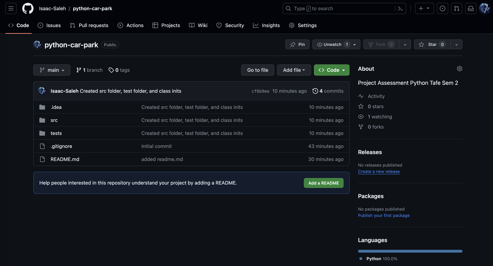

<h1> Smart Car Park</h1>

<h3>This is a Tafe Semester 1 Project for IP4RIoT</h3>

It includes a python program for a smart carpark that utilises
<ul>Classes
  <ul>Abstract class Sensor</ul>
  <ul>Carpark Class</ul>
  <ul>Display Class </ul>
  <ul> Testing files</ul>
</ul>
<ul>Sensors 
  <ul>Automatic sensorts that register the cars as they enter and exit</ul>
</ul>
<ul>Displays 
  <ul>The available bays</ul>
  <ul>The current temperature</ul>
  <ul> If the car park is full</ul>
</ul>
<h5>First Commit Screenshot</h5>

